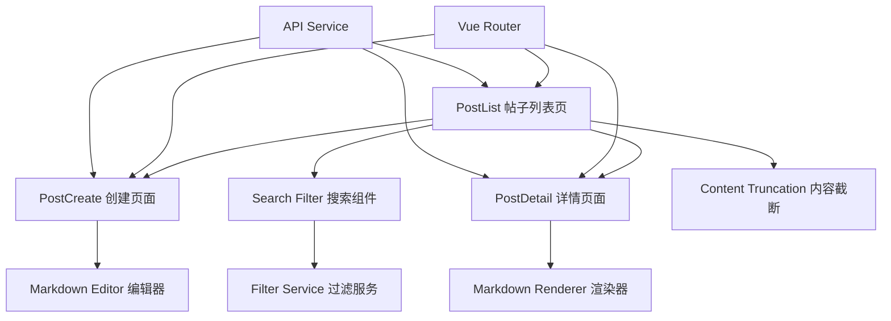

# 设计文档

## 概述

本设计文档描述了博客帖子管理系统的增强功能实现方案。主要目标是将帖子创建功能独立化，增加Markdown支持，优化帖子列表展示，并提供强大的搜索过滤功能。

该设计基于现有的Vue 3 + TypeScript + Ant Design Vue技术栈，保持与现有系统的一致性和兼容性。

## 架构

### 整体架构图



### 技术栈选择

基于研究结果，我们选择以下技术方案：

1. **Markdown编辑器**: `md-editor-v3` - 专为Vue 3设计，功能完整，支持TypeScript
2. **Markdown渲染**: `markdown-it` + `vue3-markdown-it` - 轻量级，高性能
3. **路由管理**: Vue Router 4 - 使用嵌套路由组织页面结构
4. **UI组件**: 继续使用Ant Design Vue - 保持设计一致性

## 组件和接口

### 1. PostCreate 组件

**职责**: 独立的帖子创建页面，支持Markdown编辑

**接口**:
```typescript
interface PostCreateProps {
  // 无props，通过路由参数获取信息
}

interface PostCreateEmits {
  // 无emits，通过路由导航处理页面跳转
}

interface PostCreateData {
  form: {
    title: string;
    content: string;
    published: boolean;
  };
  loading: boolean;
  error: string;
}
```

**主要方法**:
- `handleSubmit()`: 提交新帖子
- `handleCancel()`: 取消创建，返回列表页
- `validateForm()`: 表单验证

### 2. PostDetail 组件

**职责**: 显示帖子完整内容，支持Markdown渲染

**接口**:
```typescript
interface PostDetailProps {
  // 通过路由参数获取帖子ID
}

interface PostDetailData {
  post: Post | null;
  loading: boolean;
  error: string;
}
```

**主要方法**:
- `fetchPost(id: number)`: 获取帖子详情
- `handleBack()`: 返回列表页
- `handleEdit()`: 跳转到编辑页面（如果有权限）

### 3. PostList 组件（重构）

**职责**: 显示帖子列表，提供搜索过滤功能

**接口**:
```typescript
interface PostListData {
  posts: Post[];
  loading: boolean;
  error: string;
  searchFilters: SearchFilters;
  pagination: PaginationConfig;
}

interface SearchFilters {
  title: string;
  author: string;
  published: boolean | null;
  dateRange: [string, string] | null;
}
```

### 4. SearchFilter 组件

**职责**: 提供多条件搜索功能

**接口**:
```typescript
interface SearchFilterProps {
  filters: SearchFilters;
}

interface SearchFilterEmits {
  'update:filters': [filters: SearchFilters];
  'search': [filters: SearchFilters];
  'reset': [];
}
```

### 5. ContentTruncation 组件

**职责**: 内容截断显示

**接口**:
```typescript
interface ContentTruncationProps {
  content: string;
  maxLines: number; // 默认3行
  showExpand: boolean; // 是否显示展开按钮
}
```

## 数据模型

### Post 模型扩展

现有的Post接口保持不变，但需要确保content字段支持Markdown格式：

```typescript
interface Post {
  id: number;
  title: string;
  content: string | null; // Markdown格式内容
  published: boolean;
  createdAt: string;
  updatedAt: string;
  authorId: number;
  author: {
    id: number;
    name: string | null;
    email: string;
  };
}
```

### 搜索过滤器模型

```typescript
interface SearchFilters {
  title?: string;           // 标题关键词
  author?: string;          // 作者名称
  published?: boolean;      // 发布状态
  dateRange?: [string, string]; // 发布时间范围
}

interface PaginationConfig {
  current: number;
  pageSize: number;
  total: number;
  showSizeChanger: boolean;
  showQuickJumper: boolean;
}
```

## 路由设计

### 路由配置

```typescript
const routes = [
  {
    path: '/posts',
    name: 'PostList',
    component: () => import('@/components/PostList.vue'),
    meta: { requiresAuth: true }
  },
  {
    path: '/posts/create',
    name: 'PostCreate', 
    component: () => import('@/components/PostCreate.vue'),
    meta: { requiresAuth: true }
  },
  {
    path: '/posts/:id',
    name: 'PostDetail',
    component: () => import('@/components/PostDetail.vue'),
    props: true,
    meta: { requiresAuth: true }
  }
];
```

### 导航流程

1. **PostList → PostCreate**: 点击"新建帖子"按钮
2. **PostCreate → PostList**: 创建成功或取消后返回
3. **PostList → PostDetail**: 点击"详情"按钮
4. **PostDetail → PostList**: 点击"返回"按钮
5. **PostDetail → PostCreate**: 点击"编辑"按钮（如果有权限）

## API 接口设计

### 现有API保持不变

当前的postAPI接口已经满足基本需求，但需要扩展搜索功能：

```typescript
// 扩展现有的getAll方法
postAPI.getAll(params?: {
  published?: boolean;
  title?: string;
  author?: string;
  dateFrom?: string;
  dateTo?: string;
  page?: number;
  pageSize?: number;
})
```

### 新增搜索API

```typescript
postAPI.search(filters: SearchFilters, pagination?: PaginationConfig) => {
  return api.get('/posts/search', { 
    params: { 
      ...filters, 
      ...pagination 
    } 
  });
}
```

现在让我使用prework工具来分析验收标准的可测试性：

## 正确性属性

*属性是一个特征或行为，应该在系统的所有有效执行中保持为真——本质上是关于系统应该做什么的正式声明。属性作为人类可读规范和机器可验证正确性保证之间的桥梁。*

基于需求分析，以下是需要验证的正确性属性：

### 属性 1: Markdown编辑器功能支持
*对于任何* 有效的Markdown语法输入，编辑器应该正确处理并提供相应的编辑功能
**验证: 需求 2.1, 2.5**

### 属性 2: 帖子创建和存储
*对于任何* 有效的帖子数据（标题和内容），系统应该成功创建帖子并正确存储Markdown格式的内容
**验证: 需求 1.3, 2.2**

### 属性 3: Markdown渲染一致性
*对于任何* 有效的Markdown内容，渲染器应该将其转换为正确格式化的HTML，且在详情页面和其他显示位置保持一致
**验证: 需求 2.3, 3.4**

### 属性 4: 内容截断逻辑
*对于任何* 文本内容，如果超过3行则应该被截断并显示省略号，如果不超过3行则应该完整显示
**验证: 需求 3.1, 3.2**

### 属性 5: 标题搜索功能
*对于任何* 搜索关键词和帖子数据集，搜索结果应该只包含标题中包含该关键词的帖子
**验证: 需求 4.1**

### 属性 6: 发布状态过滤
*对于任何* 发布状态选择，过滤结果应该只包含匹配该状态的帖子
**验证: 需求 4.2**

### 属性 7: 作者过滤功能
*对于任何* 作者名称输入，搜索结果应该只包含该作者创建的帖子
**验证: 需求 4.3**

### 属性 8: 时间范围过滤
*对于任何* 有效的时间范围，搜索结果应该只包含在该时间范围内发布的帖子
**验证: 需求 4.4**

### 属性 9: 复合搜索条件
*对于任何* 多个搜索条件的组合，搜索结果应该只包含同时满足所有条件的帖子
**验证: 需求 4.5**

### 属性 10: 路由导航正确性
*对于任何* 有效的帖子ID，访问 `/posts/:id` 应该显示对应帖子的详情页面
**验证: 需求 5.2**

### 属性 11: 页面导航流程
*对于任何* 页面间的导航操作（创建、详情、返回），系统应该正确跳转到目标页面
**验证: 需求 5.4, 5.5, 5.6**

### 属性 12: 响应式布局适配
*对于任何* 屏幕尺寸，页面布局应该正确适配并保持可用性
**验证: 需求 6.1**

### 属性 13: 用户反馈一致性
*对于任何* 用户操作，系统应该提供适当的状态反馈（加载、成功、错误）
**验证: 需求 6.2, 6.3**

### 属性 14: 表单验证完整性
*对于任何* 无效的表单输入，系统应该显示清晰的验证错误信息并阻止提交
**验证: 需求 6.4**

## 错误处理

### 1. 网络错误处理
- **连接超时**: 显示友好的超时提示，提供重试选项
- **服务器错误**: 显示具体错误信息，记录错误日志
- **认证失败**: 自动跳转到登录页面

### 2. 数据验证错误
- **表单验证**: 实时验证用户输入，显示具体错误信息
- **Markdown解析错误**: 提供语法错误提示和修正建议
- **文件上传错误**: 显示文件大小、格式限制提示

### 3. 路由错误处理
- **404错误**: 显示友好的页面未找到提示
- **权限错误**: 显示权限不足提示，引导用户登录
- **参数错误**: 验证路由参数，无效时重定向到列表页

### 4. 组件错误边界
```typescript
// 错误边界组件处理渲染错误
interface ErrorBoundaryState {
  hasError: boolean;
  error: Error | null;
}

// 错误恢复策略
const errorRecoveryStrategies = {
  markdown: '使用纯文本模式显示',
  search: '重置搜索条件',
  navigation: '返回首页'
};
```

## 测试策略

### 双重测试方法

我们将采用单元测试和基于属性的测试相结合的方法：

- **单元测试**: 验证特定示例、边缘情况和错误条件
- **属性测试**: 验证跨所有输入的通用属性
- 两者互补，提供全面覆盖

### 单元测试重点

单元测试应专注于：
- 特定示例，展示正确行为
- 组件间集成点
- 边缘情况和错误条件

避免编写过多单元测试 - 基于属性的测试处理大量输入覆盖。

### 基于属性的测试配置

- **最小迭代次数**: 每个属性测试100次（由于随机化）
- **测试库**: 使用 `fast-check` 进行JavaScript/TypeScript属性测试
- **标签格式**: **功能: blog-post-enhancement, 属性 {编号}: {属性文本}**
- 每个正确性属性必须由单个基于属性的测试实现

### 测试组织结构

```
tests/
├── unit/                    # 单元测试
│   ├── components/         # 组件测试
│   ├── services/          # 服务测试
│   └── utils/             # 工具函数测试
├── properties/             # 基于属性的测试
│   ├── markdown.test.ts   # Markdown相关属性
│   ├── search.test.ts     # 搜索功能属性
│   └── navigation.test.ts # 导航功能属性
└── integration/           # 集成测试
    ├── user-flows.test.ts # 用户流程测试
    └── api.test.ts        # API集成测试
```

### 测试数据生成策略

为基于属性的测试编写智能生成器：

```typescript
// Markdown内容生成器
const markdownGenerator = fc.string().map(content => {
  // 生成包含各种Markdown语法的内容
  return generateMarkdownContent(content);
});

// 搜索条件生成器
const searchFiltersGenerator = fc.record({
  title: fc.option(fc.string()),
  author: fc.option(fc.string()),
  published: fc.option(fc.boolean()),
  dateRange: fc.option(fc.tuple(fc.date(), fc.date()))
});
```

### 持续集成要求

- 所有测试必须在提交前通过
- 基于属性的测试在CI环境中运行更多迭代（1000次）
- 代码覆盖率目标：90%以上
- 性能测试：页面加载时间 < 2秒